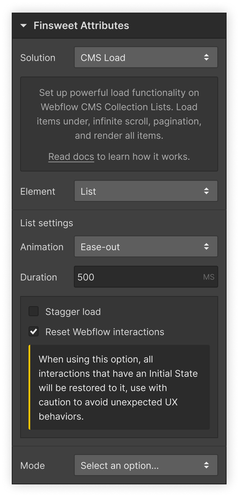

# Webflow Native

This is a prototype that attempts to validate a development tool for creating "Attributes" schemas.

## About

As exposed in the presentation, the new "Attributes inside Designer" UI would allow users to define HTML attributes to elements in a visual way throgh the Settings panel in the Webflow Designer.



Under the hood, when the users select options inside this new Settings UI, Webflow would apply HTML attributes to the elements just like the native components like Slider and Tabs already do.

For instance, doing the following actions in the Designer:

1. Select an element.
2. Go to the Settings panel, under the Finsweet Attributes accordion.
3. Open the Finsweet Attributes accordion.
4. Select `Solution = CMS Load` and `Element = List`.

Would apply to the element a `fs-cmsload-element="list"` HTML attribute.

This system would be, of course, not limited to just Finsweet Attributes, but to any library that relies on HTML attributes to run on the website.

## Developers

The create new integrations, developers would create a schema that defines the relationship between the UI elements under the Settings panel and the applied HTML attributes.

This schema would then be sent to Webflow to include it in the Designer as a new integration option. Ideally there would be an option to integrate in a CI/CD workflow.

## Install

```bash
# install as project dependency
$ npm install --save-dev webflow-native

# or install globally
$ npm install --global webflow-native
```

## Usage

You can see an example of usage in `packages/example`.

```bash
# validates and builds a schema
# "src/index.ts" would be the entry file that default-exports the schema
$ webflow-native build src/index.ts

# validates, builds and publishes a schema to Webflow
$ webflow-native publish src/index.ts
```
